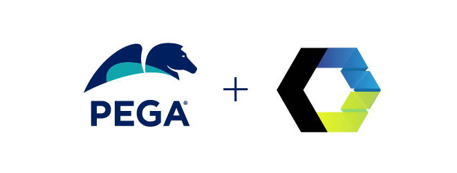

# Web Components SDK - Release Announcement - v24.2.11

The **SDK-WC v24.2.11** release is **only compatible with Pega Infinity '24.2**. This release is available in the [**release/24.2.11**](https://github.com/pegasystems/web-components-sdk/tree/release/24.2.11) branch of the Web Components SDK repository.

**Note**: The main branch is the active development branch for future versions of Web Components SDK.

This release allows Web components SDK users to take advantage of the latest SDK enhancements and fixes. For more information, see
[What's new in SDK-WC v24.2.11](https://docs.pega.com/bundle/constellation-sdk/page/constellation-sdks/sdks/web-components-sdk-updates.html).

This [Web Components SDK updates](https://docs.pega.com/bundle/constellation-sdk/page/constellation-sdks/sdks/web-components-sdk-updates.html) page provides details about all of the Web Components SDK releases.
 

---

# Overview

The **Web Components SDK** provides Pega customers with the ability to build DX components that connect Pega’s ConstellationJS Engine APIs with a design system other than the Constellation design system.

The alternative design system used in this Web Components SDK is based on
[Lion web components](https://lion-web.netlify.app/), which are open-source components that are designed to be extended and flexibly integrated with other components. The Lion web components are built with [LitElement](https://lit-element.polymer-project.org/guide)
and [lit-html](https://lit-html.polymer-project.org/guide).

 

# Prerequisites

## Pega Infinity Server and Constellation-enabled Application

This version of the Web Components SDK assumes that you have access to a Pega Infinity server (**'24.2 GA and later versions**) running an application that is configured to run using the Constellation UI service.

The **MediaCo** sample application is already configured as a Constellation architecture-based application and can be found in the Web Components SDK download associated with this repo which is available at the [Marketplace page](https://community.pega.com/marketplace/components/web-components-sdk). The OAuth 2.0 Client Registration records associated with the **MediaCo** application are available in the same Web Components SDK download. For more information about the MediaCo sample application, see [MediaCo sample application](https://docs.pega.com/bundle/constellation-sdk/page/constellation-sdks/sdks/mediaco-sample-application.html).

The **Web Components SDK** has been tested with:
- node 24.11.0
- npm 11.6.1

Future updates to the SDK will support more recent LTS versions of node as the Constellation architecture supports them.
 

---

# Troubleshooting
If you are facing any issues, please see [Troubleshooting Constellation SDKs](https://docs.pega.com/bundle/constellation-sdk/page/constellation-sdks/sdks/troubleshooting-constellation-sdks.html).
 

---

## License

This project is licensed under the terms of the **Apache 2** license.

You can see the full license [here](LICENSE) or directly on [apache.org](https://www.apache.org/licenses/LICENSE-2.0).
 

---

## Contributing

We welcome contributions to the Web Components SDK project.

Refer to our [guidelines for contributors](./docs/CONTRIBUTING.md) if you are interested in contributing to the project.

---

## Additional Resources

- [LitElement](https://lit-element.polymer-project.org/guide)
- [lit-html](https://lit-html.polymer-project.org/guide)
- [Lion Web Components GitHub](https://github.com/ing-bank/lion)
- [Lion Web Components Documentation Site](https://lion-web.netlify.app/)
- [Constellation SDKs Documentation](https://docs.pega.com/bundle/constellation-sdk/page/constellation-sdks/sdks/constellation-sdks.html)
- [Troubleshooting Constellation SDKs](https://docs.pega.com/bundle/constellation-sdk/page/constellation-sdks/sdks/troubleshooting-constellation-sdks.html)
- [MediaCo sample application](https://docs.pega.com/bundle/constellation-sdk/page/constellation-sdks/sdks/mediaco-sample-application.html)
