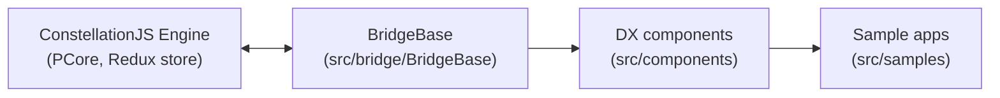

# Architecture

Technical reference for the Pega Web Components SDK (**SDK-WC**). Tactical agent rules live in
[AGENTS.md](../AGENTS.md); durable project principles live in
[.specify/memory/constitution.md](../.specify/memory/constitution.md).

---

## 1. Tech stack

| Concern | Choice |
|---------|--------|
| UI framework | [Lit](https://lit.dev) (`LitElement` + `lit-html`) |
| Design system | [Lion web components](https://lion-web.netlify.app/) plus Vaadin components |
| Language | TypeScript (ES2022, `strict: true`) — see [tsconfig.json](../tsconfig.json) |
| Bundler | Webpack 5 — see [webpack.config.js](../webpack.config.js) |
| Transpiler | Babel — see [babel.config.js](../babel.config.js) |
| Routing (samples) | `@vaadin/router` |
| E2E testing | Playwright (Chromium) — see [playwright.config.js](../playwright.config.js) |
| Engine contract | `@pega/pcore-pconnect-typedefs` against Pega Infinity `'24.2` |

## 2. High-level design

The SDK is a thin, replaceable presentation layer over Pega's ConstellationJS Engine. The engine owns
case data, state, and actions; the SDK owns rendering and user interaction.

- **PConnect** objects are handed to a component through its `pConn` property.
- `BridgeBase` extends `LitElement` and centralizes store subscription, prop normalization, action
  wiring, and re-render bookkeeping so individual components never talk to `PCore` directly.
- Components collect their `lit-html` output into `renderTemplates`, letting `BridgeBase` control the
  render root and shared Bootstrap styling.

### Why the bridge exists

`src/bridge/BridgeBase` is the single seam between engine internals and component code. Keeping every
engine touchpoint behind it is what allows the SDK to track Infinity releases without rewriting
components — see Principle I in the constitution.

## 3. Repository layout

| Path | Purpose |
|------|---------|
| [src/index.ts](../src/index.ts), [src/index.html](../src/index.html) | SDK entry points; registers the sample routes |
| [src/bridge/BridgeBase](../src/bridge/BridgeBase) | Base class bridging the Constellation engine and web components |
| [src/components](../src/components) | All DX web components (one folder per component) |
| [src/components/fields](../src/components/fields) | Form field components (extend `FormComponentBase`) |
| [src/components/templates](../src/components/templates) | View / page template components |
| [src/components/widgets](../src/components/widgets) | Compound widgets reusable across the app |
| [src/helpers](../src/helpers) | Shared utilities (formatting, dates, events, data pages) |
| [src/samples](../src/samples) | Sample apps: `Embedded`, `FullPortal`, `SimplePortal` |
| [src/types](../src/types) | Shared TS interfaces (e.g. `PConnProps`) |
| [assets](../assets) | CSS, icons, images (many pre-compressed `.br`) |
| [tests/e2e](../tests/e2e) | Playwright suites (`DigV2`, `MediaCo`) |
| [types](../types) | Generated `.d.ts` output — **do not hand-edit** |
| [docs](../docs) | Human-facing docs |

## 4. Component model

Every component follows the same shape (see
[src/components/Boilerplate](../src/components/Boilerplate) as the copy-paste starting point and
[src/components/hello-world/hello-world.ts](../src/components/hello-world/hello-world.ts) as the
minimal Lit example):

- One folder per component: `src/components/<Name>/index.ts`.
- Styles longer than a few lines go in a sibling `<name>-styles.ts` exporting a `css` template.
- The public tag is registered with `@customElement('kebab-case-tag')`; the Custom Elements standard
  requires the hyphen.
- Public reactive state is declared with `@property({ type: ... })`.
- Any nested custom element the template renders must be imported explicitly in that module,
  otherwise the tag never upgrades.

Categories:

- **fields** — `TextInput`, `Dropdown`, `Date`, `Currency`, … all extend `FormComponentBase`, which
  layers validation and change/blur event plumbing on top of `BridgeBase`.
- **templates** — `CaseView`, `OneColumnTab`, `TwoColumn`, `SimpleTable`, … render engine-provided
  view configurations and delegate child rendering to `Region`/`View`.
- **widgets** — `AppAnnouncement`, `CaseHistory`, `CaseOperator`, `FileUtility`.
- **root-level** — container and navigation components such as `RootContainer`, `ViewContainer`,
  `FlowContainer`, `Assignment`, `NavBar`, `Stages`.

## 5. Sample applications

[src/index.ts](../src/index.ts) wires a `@vaadin/router` outlet to three sample entry components:

| Route | Component | Scenario |
|-------|-----------|----------|
| `/`, `/embedded` | `embedded-component` | SDK components embedded in an existing page |
| `/portal`, `/fullportal` | `full-portal-component` | Full Constellation portal experience |
| `/simpleportal` | `simple-portal-component` | Minimal portal shell |

Connection settings come from [sdk-config.json](../sdk-config.json), which customers replace locally.

## 6. Build & test pipeline

- Webpack 5 bundles `src/index.ts` and the static assets into `dist/`; Brotli-compressed assets under
  `assets/**/*.br` are build products — edit the uncompressed source instead.
- `npm run analyze` generates the Custom Elements Manifest.
- Generated typings land in `types/` and must not be hand-edited.
- There is no unit-test harness. Playwright suites under [tests/e2e](../tests/e2e) are the only
  automated tests and require a running Pega Infinity server plus the **MediaCo** sample app.

## 7. Further reading

- [docs/CONTRIBUTING.md](CONTRIBUTING.md)
- [docs/ImplementationNotes.md](ImplementationNotes.md)
- [docs/KeyReleaseUpdates.md](KeyReleaseUpdates.md)
- [src/components/README.md](../src/components/README.md) — step-by-step guide to adding a component
